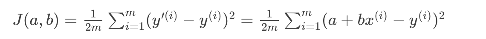
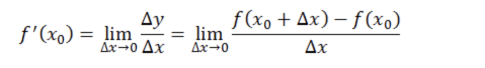

# 第10课：线性回归——从模型函数到目标函数

线性回归概念

* 线 = 性 <> 直线，不要混淆
* 线性函数：一阶（或更低阶）多项式，或零多项式
* 一元多项式 y = WX,f(x1,x2)=a+b1x2+b2x=a+b1x1+b2x2,其中X = （x1,x2) 

模型函数向目标函数的转换

* f(x) = WX  的目标函数如下：

回归高中时的导数定义： 　 

　反映的是函数y=f(x)在某一点处沿x轴正方向的变化率。再强调一遍，是函数f(x)在x轴上某一点处沿着x轴正方向的变化率/变化趋势。直观地看，也就是在x轴上某一点处，如果f’(x)>0，说明f(x)的函数值在x点沿x轴正方向是趋于增加的；如果f’(x)<0，说明f(x)的函数值在x点沿x轴正方向是趋于减少的。

　这里补充上图中的Δy、dy等符号的意义及关系如下： 
　Δx：x的变化量； 
　dx：x的变化量Δx趋于0时，则记作微元dx； 
　Δy：Δy=f(x0+Δx)-f(x0)，是函数的增量； 
　dy：dy=f’(x0)dx，是切线的增量； 

​    当Δx→0时，dy与Δy都是无穷小，dy是Δy的主部，即Δy=dy+o(Δx). 

