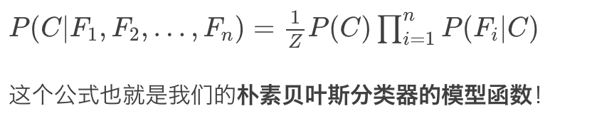

# 第12课：朴素贝叶斯分类器——从贝叶斯定理到分类模型

分类和回归的区别：

* 分类是预测一个标签，输出的结果是离散值
* 回归是预测一个量，输出的结果是连续值

简化版贝叶斯公式：P(A|B)=P(B|A)P(A)/P(B)

一般化贝叶斯公式：P(Ai|B)=P(B|Ai)P(Ai)/(∑jP(B|Aj)P(Aj))

先验事件和后验事件的概率都是离散的

**朴素贝叶斯算法 Naïve Bayes Classifier 简称NB**

* P(A|b1,b2,…,bn)=P(A)P(b1,b2,…,bn|A) / P(b1,b2,…,bn)

* A的先验概率P(A)和多个因素的联合概率P(b1,b2,..bn) 都是可以单独计算的

* P(b1,b2...,bn|A) 是求解的关键，根据链式求导法则得出

  * P(b1,b2,…,bn|A)=P(b1|A)P(b2|A,b1)P(b3|A,b1,b2)...P(bn|A,b1,b2,...,bn−1)

* 当b1,b2..bn特征都不相关时

  * P(A|b1,b2,…,bn)= P(A)*P(b1|A)*....P(bn|A) / P(b1,b2...bn)

* b1,b2…bn时特征(Feature),A是类别(Class），此处的 Z 对应 P(b1,b2,…,bn)

  

**朴素贝叶斯的训练过程**

* 类别(c1,c2...ck),特征(F1,F2,...Fn),样本s
* 计算P(C=cj)∏P(Fi=fi|C=cj) 的每一个值
* 比较这k次的记过，选择结果最大的cj，就是对应的类别

备注：P(A|b1,b2,…,bn)= P(A)*P(b1|A)*....P(bn|A) / P(b1,b2...bn) 等价于 P(A|b1,b2,…,bn)= P(A)*P(b1|A)*....P(bn|A) 

朴素贝叶斯只需比较每个类别概率值的相对大小就可以了

