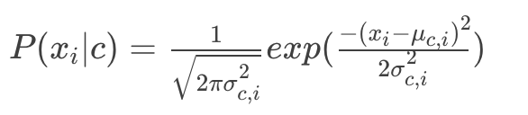
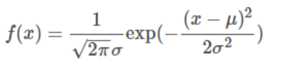
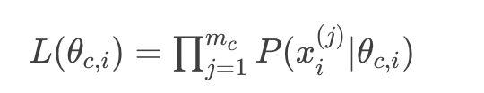
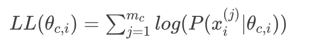

# 第13课：朴素贝叶斯分类器——条件概率的参数估计

不再简单的将频率当做概率，采用另一种方式，通过该特征在数据样本中的分布来计算该特征的田间概率

明确一下符号：

- D：表示训练集
- Dc：表示训练集中最终分类结果为 c 的那部分样本的集合
- X：表示一个训练样本（单个样本）
- x(j)i：表示第 j 个样本的第 ii个特征的特征值
- m：D 中样本的个数
- mc：Dc 中样本的个数，一般情况下（mc<m）

**P(xi|c) 符合高斯分布，又叫正太分布**

高斯分布（Gaussian Distribution）的概率密度函数（probability density function）

**高斯分布曲线的特点**

* 均值越大，中心点越靠右，方差越大，图像越矮胖

**极大似然估计(Maximum Likelihood Estimation MLE)**

Dc是训练集中所有被分类为 c 的样本的集合，其中样本数量为 mc；每一个样本都有 n 个特征；每一个特征有一个对应的取值。我们将第j个样本的第 i 个特征值记作：xi(j)

**似然和概率的区别：**

* 概率是在已知参数的情况下，用来预测后续观测所得到的结果
* 似然是用于参数未知，但某些观测所得到结果已知的情况，用来对参数进行估计

**参数 θc,i 的似然函数记作 L(θc,i)，它表示了 Dc中的 mc个样本 X1，X2，…Xmc在第 i个特征上的联合概率分布**

极大似然估计就是去寻找让似然函数的取值达到最大值的参数值得估计方法

对极大似然函数求对数，得到对数似然，二者结果等价

**总结：**

* 后验概率在实际中一般是很难直接计算出来的，相反先验概率就容易多了。因此一般会利用先验概率来计算后验概率
* P(y|x) = ( P(x|y) * P(y) ) / P(x)  贝叶斯公式
  * P(y|x) 是后验概率，一般是我们求解的目标。
  * P(x|y) 是条件概率，又叫似然概率，一般是通过历史数据统计得到。一般不把它叫做先验概率，但从定义上也符合先验定义。
  * P(y) 是先验概率，一般都是人主观给出的。贝叶斯中的先验概率一般特指它。
  * P(x) 其实也是先验概率，只是在贝叶斯的很多应用中不重要（因为只要最大后验不求绝对值），需要时往往用全概率公式计算得到。
  * 在使用贝叶斯定理时，我们通过将先验概率与似然函数相乘，随后标准化，来得到后验概率分布，也就是给出某数据，该不确定量的条件分布。

