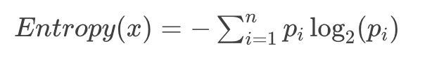
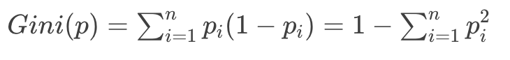

# 第16课：决策树——既能分类又能回归的模型

**相关概念：**

* 熵（entropy）： 熵指的是体系的混乱的程度，在不同的学科中也有引申出的更为具体的定义，是各领域十分重要的参量。

* 香农熵： 是一种信息的度量方式，表示信息的混乱程度，也就是说：信息越有序，信息熵越低。例如：火柴有序放在火柴盒里，熵值很低，相反，熵值很高。

* 信息增益（information gain）： 在划分数据集前后信息发生的变化称为信息增益，前-后。

**构建决策树过程：**

* 准备若干的训练数据
* 标注每个样本的类别
* 选取特征--决策条件
* 为每个训练样本对应所需的特征生成对应值—数值化的特征
* 根据一定的原则，决定特征的重要程度，然后按照决策重要性从高到底生成决策树

**ID3算法：**

假设一个随机变量 x 有 n 种取值，分别为{x1,x1,...,xn}，每一种取值取到的概率分别是 {p1,p2,...,pn}{p1,p2,...,pn}，那么 x 的信息熵定义为：

信息增益（information gain）： 在划分数据集前后信息发生的变化称为信息增益，前-后

**缺点**：1、ID3一般会优先选择取值种类较多的特征作为分裂特征

​	   2、不能处理取值在连续区间的特征

**C4.5算法：**

C4.5 选用**信息增益率**（Gain Ratio)——用比例而不是单纯的量——作为选择分支的标准。

C4.5如何处理连续特征？ 具体做法如下：

* 把需要处理的样本进行从小到大排序
* K-1个分割点，把原来连续的一个特征，转换为k-1个bool特征
* 用信息增益率选择这k-1个特征的最佳划分

**CART算法：**

* 全称：Classification and Regression Tree分类和和回归树，既可以做分类，又可以做回归

* 特征选取依据：Gini系数(Gini Coefficient),每次选择Gini系数最小的特征作为最优切分点

* CART是一颗严格的二叉树，每次分裂只做二分

* Gini系数计算方式： 

  

* 二分类中Gini(p) = p(1-p)+(1-p)(1-(1-p)) = 2p(1-p),两种可能性的概率越不平均，则越可能是最佳切分点

**回归树和分类树的区别：**

​	在于最终的输出值到底是连续的还是离散的，每个特征——也就是分裂点决策条件——无论特征值本身是连续的还是离散的，都要被当作离散的来处理，而且都是被转化为二分类特征，来进行处理：

​	如果对应的分裂特征是连续的，处理与C4.5算法类似

​	如果特征是离散的，而该特征总共有k个取值，则将这一个特征转换为k个特征，对每一个新特征按照是不是取这个值来分Yes和No

