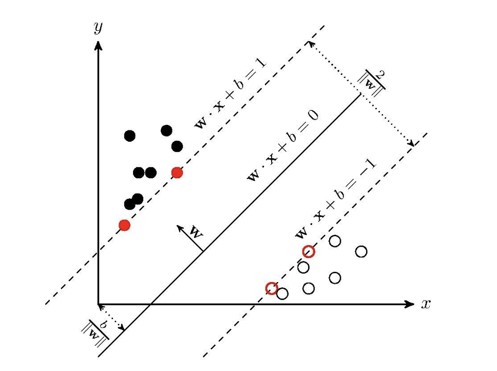

# 第18课：SVM——线性可分 SVM 原理

**SVM 线性可分支持向量机**

* 超平面：n维欧式空间中维度等于n-1的线性子空间，如何定义最佳超平面？

  * 1.两类样本分别分隔在该超平面的两侧
  * 2.两侧距离超平面最近的样本点到超平面的距离被最大化，这样的超平面又叫做最大间隔超平面

  

* 目标函数：min((||w||**2)/2)

* 分隔超平面`函数间距`:  (y(x)=w^Tx+b)

* 分类的结果：f(x)=sign(w^Tx+b) (sign表示>0为1，<0为-1，=0为0) 
* 点到超平面的`几何间距`: (d(x)=(w^Tx+b)/||w||\)  （||w||表示w矩阵的二范数=> \(sqrt{w^T*w}), 点到超平面的距离也是类似的）

