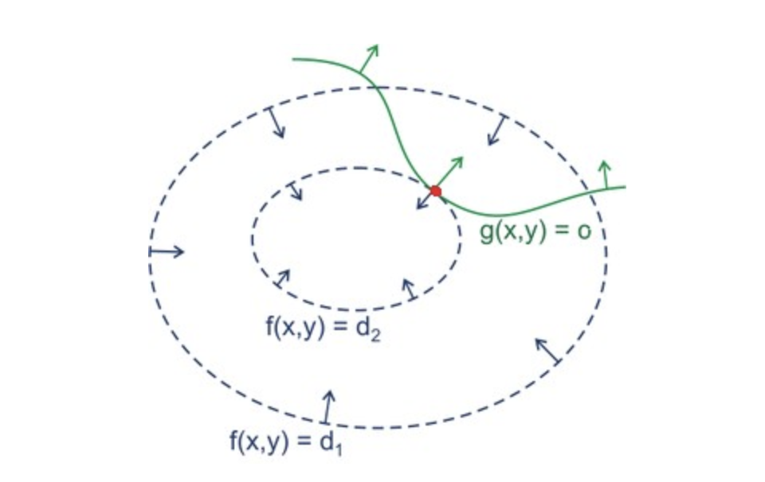
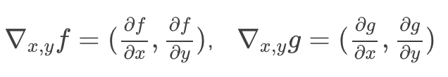

# 第19课：SVM——直观理解拉格朗日乘子法

**梯度下降和拉格朗日的区别：**

* 梯度下降求解最优化没有限制条件
* 拉格朗日有限制条件

**约束条件对函数的约束：**

* 建立三维图像 z=f(x,y)
* 在z = 0 的平面上，把y=h(x)的图像(一条曲线)画出来
* 把y = h(x) 沿着平行于z轴的方向平移，和z=f(x,y)形成的曲面相交，交叠的部分是一条三维空间中的曲线
* 相当于z=f(x,y) 在 0 = f(x,y)上的投影
* min f(x,y)  s.t.g(x,y)=0

* 曲面f(x1,x2),g(x1,x2))在最大值位置梯度方向是相同的。 换句话讲，如果规划问题在(x1,x2)处取得最大值，一定存在常数 λ 使得， ∇f(x1,x2)=λ∇g(x1,x2) 

* 绿线是g(x,y)的等高线，因为约束条件是g(x,y) = 0,因此只有一条g(x,y)的等高线g(x,y)=0有意义

* 蓝线是 f(x,y)的等高线。图中两条蓝线具体对应的函数分别是 f(x,y)=d1和 f(x,y)=d2 d1 和 d2 是两个常数，对应上图中两个蓝圈对应的  z 轴坐标。此处， d2<d1

  图中红点，映射到 f(x,y) 上，就是取得 f(x,y) 符合  g(x,y)=0 的约束的极小值的点。

**函数的梯度：**

* 表示该函数在某点处的方向导数，方向倒数是某个点的沿着每个维度分别求导后，再组合而成的向量
* 
* 一个函数的梯度于它的等高线垂直
* f(x,y)=d2对应的蓝线与 g(x,y)=0对应的绿线在 (x∗，y∗)处是相切的

**拉格朗日乘子：**

* 在 (x∗,y∗)点处 f(x,y) 与g(x,y) 的梯度，要么方向相同，要么方向相反
* ∇f(x1,x2)=λ∇g(x1,x2)  λ为拉格朗日乘子

**拉格朗日函数**：

* L(x,y,λ) = f(x,y) + λg(x,y)

* 只有当f(x,y) 梯度方向和 g(x,y)<0 区域所在方向相同，也就是和(x∗,y∗) 点处g(⋅) 函数梯度方向相反，那么f(x,y) 的约束条件极小值才会出现在g(x,y)=0 的曲线上。所以，在这种情况下，存在常数λ>0，使得 f′x,y(x∗,y∗)=−λg′x,y(x∗,y∗)，进一步导出：f′x,y(x∗,y∗)+λg′x,y(x∗,y∗)=0，λ>0

**KKT约束条件：**

* g(x,y)⩽0 ;
* λ⩾0;
* λg(x,y)=0

