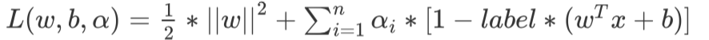
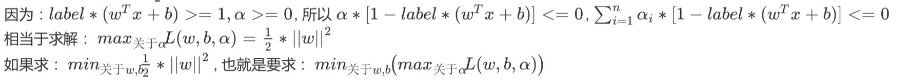
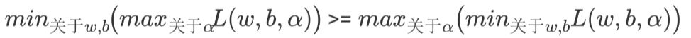
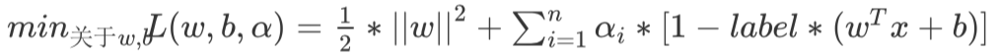
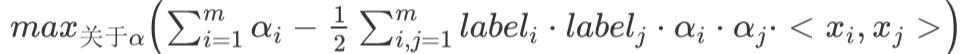
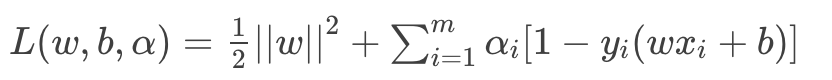
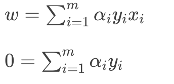
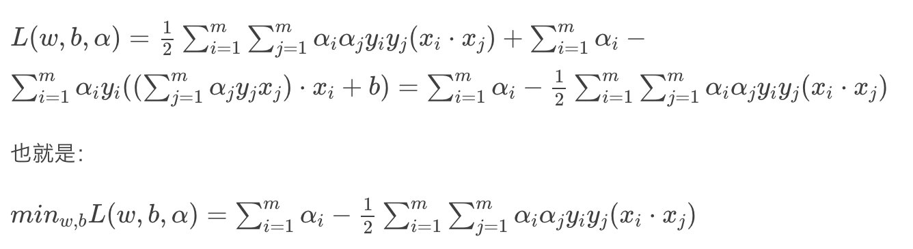
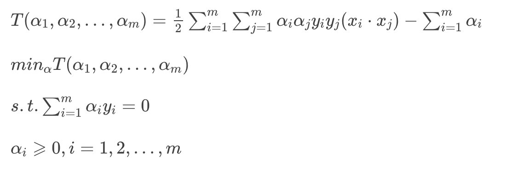

# 第20课：SVM——对偶学习算法

分隔超平面；y(x) = wTx + b

分类结果：f(x) = sign(wTx + b)

**拉格朗日乘法：**

* 类别标签用-1，1  lable*(wTx+ b) >0 表示预测正确，否则错误

* 找到最小间隔的数据点，就是支持向量

  * 最小的距离：最小间隔的数据点
  * 最大间距：支持向量

* 目标函数：arg:max关于w,b (min[lable * (wTx + b) ]*(1/||w||))

  * 约束条件 lable * (wTx + b) = 1
  * arg： max关于w,b (1/||w||),但是求解矩阵比较麻烦，如果x知识0.5* x**2 的偏导数，同样是求最小值
  * arg:    min(0.5*||w||**2)
  * 本质上就是求线性不等式的二次优化问题，求分隔超平面，等价于求解相应的凸二次规划问题

* 二次优化问题：

  * 定义新函数 F(x,y,λ)=f(x,y)+λg(x,y)

  * a为λ(a>=0)，代表要引入的拉格朗日乘子(Lagrange multiplier)

  * 

  * 

  * 转化到对偶问题的求解：

    * 

    * 
    * 最终结果如下：
    * 

* 拉格朗日乘子：新引进的系数，旨在通过增加函数变量的数量，把求解有约束的函数极值问题转换为无约束的函数极值问题。 

* 通过对偶问题求解主问题

  * 构造拉格朗日函数，引入非负参数的拉格朗日算子去给目标函数加上限制；
  * 求拉格朗日函数对主变量的极小——将拉格朗日函数对主变量求偏导，令其为零后得出主变量与对偶变量的数值关系，由此把对主变量进行极小化的拉格朗日函数转化为一个对偶变量的函数；
  * 求上面，得出的函数对对偶变量的极大，就把求解主问题转换为了极大极小问题

* 通过对偶算法求解线性可分svm的步骤

  * 1、对主问题构造拉格朗日函数：引入拉格朗日乘子 αi⩾0，其中i=1，2，…,m 得到拉格朗日函数

    * 

  * 2、求拉格朗日函数对于w,b 的极小

    * df(w)/dw = (w1,w2..)=w
    * 对拉格朗日函数对w，b分别求偏导，然后分别让两个偏导结果等于0
      * 
    * 将这两个等式带入拉格朗日函数得到如下
      * 

  * 3、求minw,b L(w,b,a) 对 a的极大

    * maxα minw,b L(w,b,α) 就是对偶问题

    * s.t.∑ αiyi=0 

      αi⩾0,i=1,2,...,m

**SMO算法**

* 优化目标：

