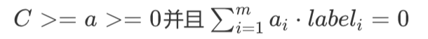
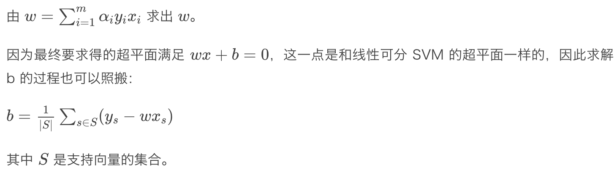
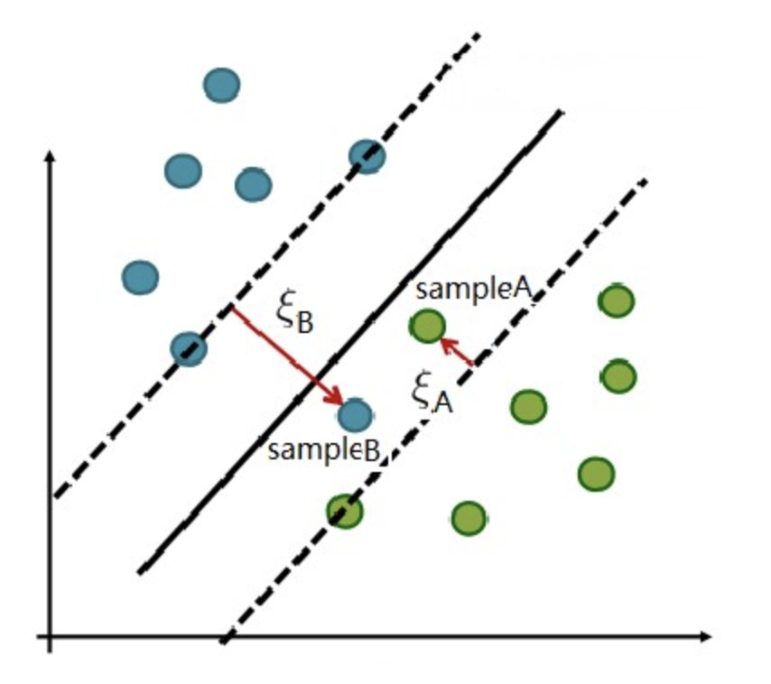

# 第21课：SVM——线性 SVM，间隔由硬到软

**SVM分类**

* 线性可分svm
* 线性svm
* 非线性svm

**软间隔**

* 允许部分样本不满足约束条件 yi(wxi+b) >=1

**松弛变量**

* 几乎所有的数据都不那么干净, 通过引入松弛变量来允许数据点可以处于分隔面错误的一侧。
* 约束条件: 
* 常量C用于控制“最大化间隔”和“保证大部分点的函数间隔小于1.0” 这两个目标的权重。
* 常量C是一个常数，我们通过调节该参数得到不同的结果。一旦求出了所有的alpha，那么分隔超平面就可以通过这些alpha来表示。
* 这一结论十分直接，SVM中的主要工作就是要求解 alpha.

**svm求解主问题总结**

* 1、根据主问题构建拉格朗日函数，由拉格朗日函数的对偶性，将主问题转换为极大极小化拉格朗日函数的对偶问题

* 2、分布求解极大极小问题

  * 每次求解极值得过程中都是先对对应的函数求梯度，再令梯度为0，以此来推导出主问题参数和拉格朗日参数乘子之间的关系
  * 再将拉格朗日乘子表达的主问题参数带回到拉格朗日函数中，最终一步步将整个对偶问题推导为拉格朗日乘子和样本（xi,yi）之间的关系

* 3、通过最小化拉格朗日乘子与样本量组成的函数，求出拉格朗日乘子的值，可以用smo算法进行求解

* 4、将 Stage-3 求出的拉格朗日乘子的值带回到 Stage-2 中确定的乘子与主问题参数关系的等式中，求解主问题参数

  

对于**线性 SVM** 而言，除了落在两个辅助超平面上的样本，落在软间隔之内的样本也是它的**支持向量**

