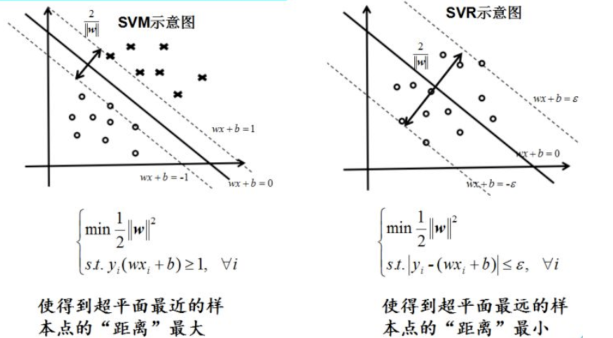

# 第24课：直观认识 SVM 和 SVR

**SVR（support vector regression）的主要思想：**

* 所谓回归（regression），基本上就是拟合，用一个函数拟合x与y的关系。对于SVR来说，x是向量，y是标量，拟合的函数形式为y=W^T*g(x)+b，其中g(x)为核函数对应的特征空间向量。*
* SVR认为，只要估计的y在实际的y的两侧一个固定的范围(epsilon)之内，就认为是估计正确，没有任何损失；
* SVR的优化目标，是|W|最小，这样y-x曲线的斜率最小，这个function最flat，这样据说可以增加估计的鲁棒性。

