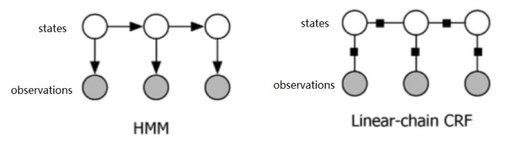

# 第28课：CRF——概率无向图模型到线性链条件随机场

**概率无向图**

* 是一个可以用无向图表示的联合概率分布
* 又可以称呼为马尔可夫随机场

**马尔克夫随机场**

* **势函数**，Potential Function,又称为因子 Factor,是定义在变量子集上的非负实函数，用于定义概率分布函数。
* **团**（Clique）：图中节点的子集，其中任意两个节点之间都有边连接。
* **极大团**：一个团，其中加入任何一个其他的节点都不能再形成团。
* 多个变量之间的联合概率分布可以基于团分解为多个势函数的乘积，每个势函数仅与一个团相关
* P(X)=(1/Z)∏Q∈C*ΨQ(XQ)
  * ΨQ 为与团Q 对应的势函数，用于对团 QQ 中的变量关系进行建模
  * Z 为规范化因子
  * C∗ 为所有极大团的集合
* 这叫做 Hammersley-Clifford 定理，是随机场（Random Fields）的基础定理，它给出了一个马尔可夫随机场被表达为**正概率分布**的**充分必要条件**

**条件随机场（Conditional Random Field，CRF）**

* 马尔可夫随机场是生成式模型,直接对联合分布进行建模
* 条件随机场是判别式模型，对条件分布进行建模

**HMM VS 线性链 CRF**

* 

  注意HMM 是有向图，CRF 是无向图；

  HMM 计算的是状态和观测的联合概率，而 CRF 计算的是状态基于观测的条件概率。

* 从使用的角度进行区分：

  * HMM 多用于那种状态“原生”，而观测是状态“生成”出来的场景
  * 比如，用 HMM 来生成一段语音，则状态对应的是音节（声韵母）或文字，而观测则是这个音节所对应的声学特征
  * 比如，用 CRF 来做文本实体标记。输入一句话“我有一个苹果”，CRF 处理后将“苹果”标记成了“水果”。这个时候，“苹果”是观测，而“水果”则是对应的状态（或称标签）。
  * 总的来说，观测是客观存在的，而状态(标签)是人工打的标签，是以条件进行“判别”的结果