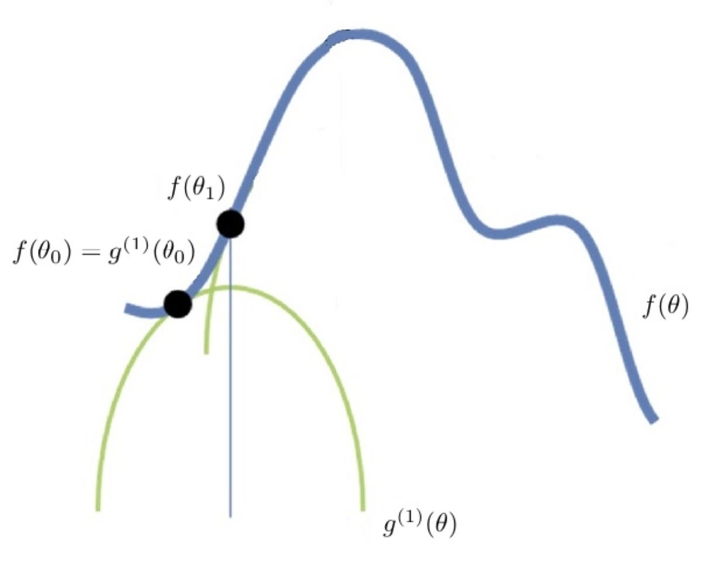
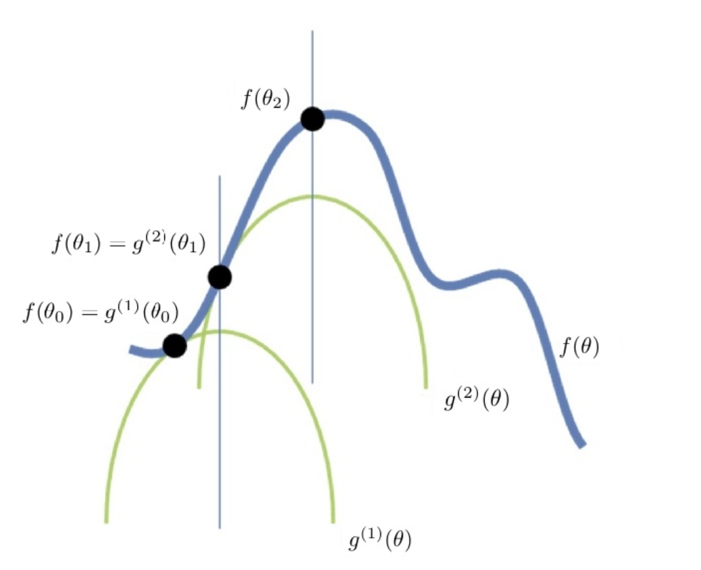

# 第33课：EM算法——估计含有隐变量的概率模型的参数

**EM算法（期望最大化,Expectation-Maximization）**

* 是一种用于对含有隐变量的概率模型的参数，进行极大似然估计的迭代算法
* 基本思想：近似极大化—通过迭代来逐步近似极大化 
* 目标函数：arg max f(θ),然而，我们对于当前这个要求取极大值的函数本身的形态并不清楚因此无法通过诸如求导函数并令其为零（梯度下降）等方法来直接探索目标函数极大值。也就是不能直接优化 f(θ)！

**求解极大化方法**

* 首先构建一个我们确定可以极大化的函数 g(1)(θ)，并且确保：

  1. f(θ)⩾g(1)(θ) ；

  2. 存在一个点 θ0，f(θ0) 和 g(1)(θ0) 在θ0 点相交，即：f(θ0)=g(1)(θ0)；

  3. θ0 不是g(1)(θ) 的极大值点。

     

  然后，再构建一个函数  g(2)(θ)，使得：

  1. f(θ)⩾g(2)(θ) ;

  2. f(θ1)=g(2)(θ1) ；

  3. θ1 不是 g(2)(θ)的极大值点。

     

  直到过程收敛——新创建出来的函数 g(m) 的极大值和 g(m−1) 的极大值几无差别为止

**总结**：

* EM算法就是通过迭代地最大化完整数据的对数似然函数的期望，来最大化不完整数据的对数似然函数

