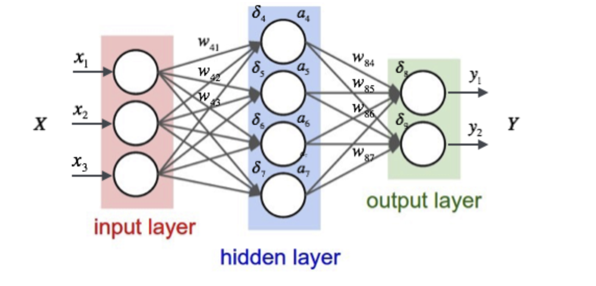
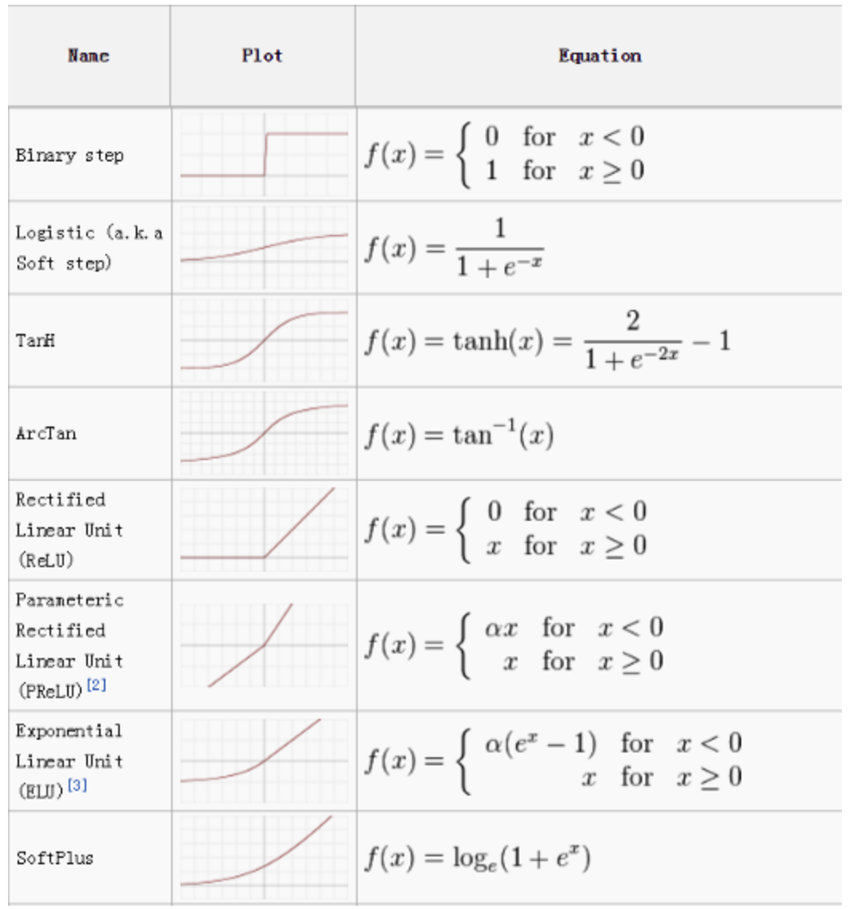

# 第38课：人工智能和神经网络

**什么是神经网络**

* 人工神经网络（Artificial Neural Network，ANN），简称神经网络（Neural Network，NN），是一种模仿生物神经网络的结构和功能的数学/计算模型，用于拟合各种函数

**神经网络**

* 神经元
* 连接

分为输入层，隐含层，输出层，除了输入层和输出层之外，所有的层都叫隐层

**常用激活函数：**

