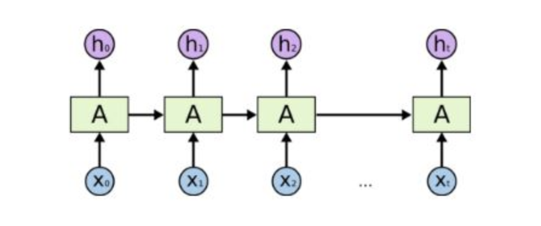
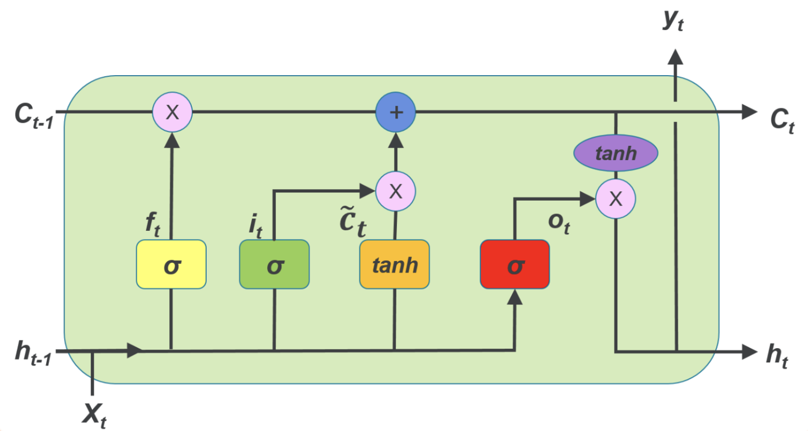
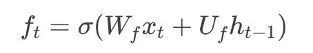
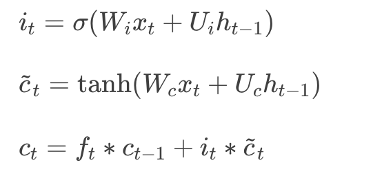
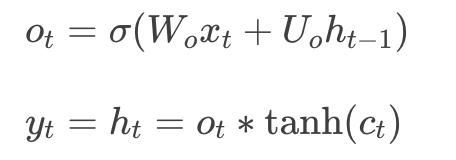

# 第39课：几种深度学习网络

**卷积神经网络（Convolutional  Neural Network,CNN）**

* CNN是一种前馈神经网络
* 通常由一个或者多个卷积层（Convolutional Layer） 和 全连接层（Fully Connected Layer）、池化层组成
* **前馈神经网络**（Feedforward NN）指每个神经元只与前一层的神经元相连，数据从前向后单向传播的 NN。其内部结构不会形成有向环
* CNN常常用于处理图像

**循环神经网络（Recurrent Neural Network,RNN）**

* RNN结构图

  

* RNN 把所处理的数据序列视作时间序列，在每一个时刻 t，每个 RNN 的神经元接受两个输入：当前时刻的输入样本 xt，和上一时刻自身的输出 ht−1

* 此外 RNN 还存在着很多变种，比如双向 RNN（Bidirectional RNN），深度双向 RNN（Deep Bidirectional RNN）等

**长短时记忆（Long Short Term Memory ,LSTM）**

* LSTM 可以被简单理解为是一种神经元更加复杂的 RNN，处理时间序列中当间隔和延迟较长时，LSTM 通常比 RNN 效果好

* 每个神经元接受的输入除了当前时刻样本输入，上一个时刻的输出，还有一个元胞状态（Cell State），LSTM 神经元结构请参见下图：

* 三个门介绍：

  * 遗忘门（Forget Gate)：接受 xt 和  ht−1 为输入，输出一个  0到 1之间的值，用于决定在多大程度上保留上一个时刻的元胞状态 ct−1， 1表示全保留，  0表示全抛弃 

    

  * 输入门（Input Gate）: 用于决定将哪些信息存储在这个时刻的元胞状态  ct 中

    

  * 输出门（Output Gate）：用于决定输出哪些信息

    

* LSTM 在很大程度上缓解了一个在 RNN 训练中非常突出的问题：梯度消失/爆炸（Gradient Vanishing/Exploding）

  * 如果梯度小于1，那么随着层数增多，梯度更新信息将会以指数形式衰减，即发生了**梯度消失（Gradient Vanishing）**；
  * 如果梯度大于1，那么随着层数增多，梯度更新将以指数形式膨胀，即发生**梯度爆炸（Gradient Exploding）**
  * Relu函数可以解决梯度消失和爆炸的问题

