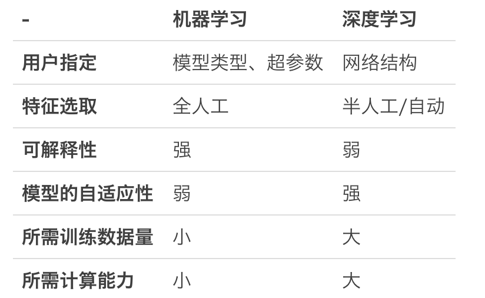

# 第40课：深度学习的愿景、问题、应用和资料

**深度学习和机器学习对比**

**语音处理的2个大方向**

* 语音识别（Speech Recognition，SR，又称为自动语音识别 Automatic Speech Recognition，ASR，或者 Speech To Text，STT）指通过自动化手段将语音转化为文本的方法和技术
* 语音合成（Speech Synthesis，又称为Text To Speech，TTS）指根据文本用机器模拟人类语音的方法和技术

**深度学习的局限**

* 深度学习仍然缺乏理论基础，模型本身可解释性差——好的结果和突破性进展来自于“尝试”而非“推理”，基本上研究处在经验阶段，未能提升到理论高度（“深度学习==炼丹”）
* 深度学习对训练数据需求巨大。特别是，目前被证明能有效应用的主要是有监督的深度学习模型，训练数据都需要标注。

**未来的方向**

* 无监督的深度学习
* 期望能够在无须标注的情况下直接利用数据。对生成对抗网络（Generative Adversarial Nets，GAN）、半监督（Semi-Supervised）学习方法的研究

